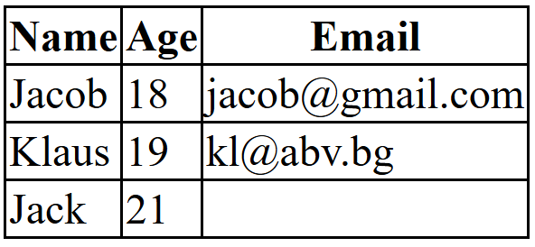
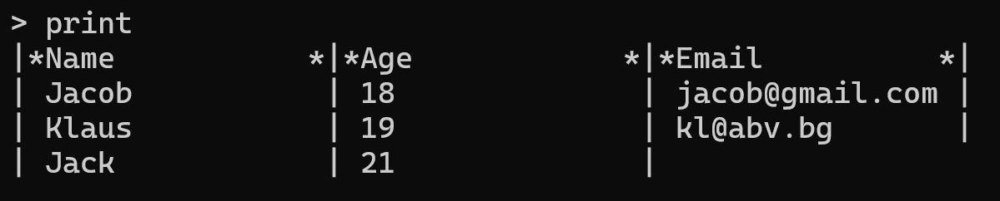
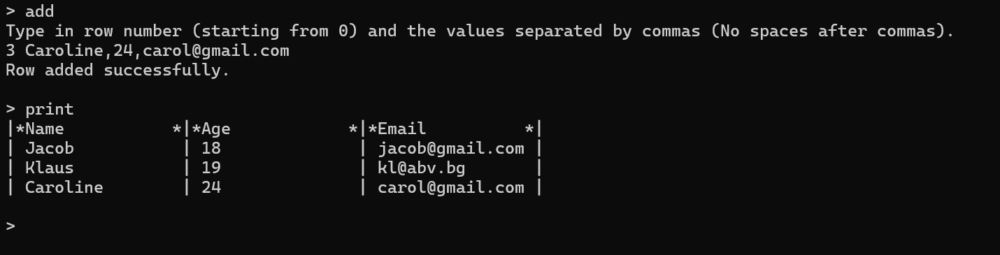
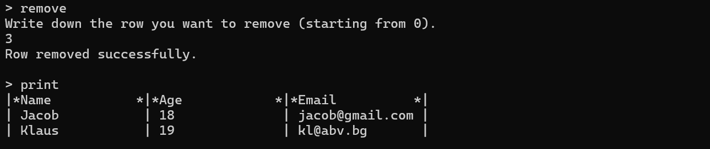
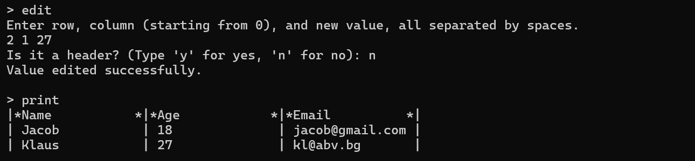
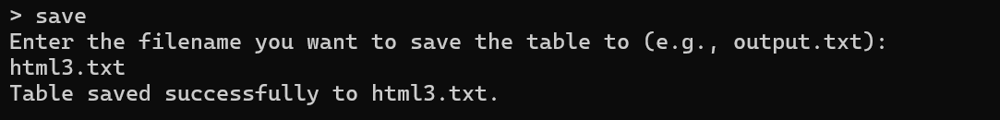
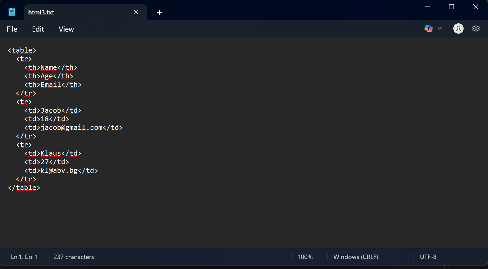

# 📋 HTML Table Parser and Formatter

## 📝 Project Description

This project is a **C++ HTML Table Parser and Formatter**.  
It reads a basic HTML-like table structure from a file, parses it into an internal data representation, and displays it neatly formatted in the console.

You can use this project to easily load, modify, and save simple HTML table structures — ideal for lightweight table editing directly from C++ without needing a browser!

---

## ✨ Features

Here’s a list of functionalities implemented in the project:

- ✅ **Parse** an HTML table structure from a `.txt` file
- ✅ **Add** table rows and header cells (`<th>`)
- ✅ **Remove** rows by selecting a row number
- ✅ **Edit** table cells by selecting a row and column number
- ✅ **Visualize** the table neatly in the console
- ✅ **Save** the HTML table back into a `.txt` file
- ✅ **Exit** the program safely (with or without saving changes)

---

## 📂 Example Usage

When you launch the program, it will ask you to type the name of the `.txt` file containing your HTML table code.  
After loading, you can use the following commands: `add`, `remove`, `edit`, `print`, `save`, `exit`.

You can find an example table structure inside the `html2.txt` file in the project folder.

---

## 🖨️ Print Command
Typing `print` in the console displays your table formatted nicely.

Original HTML table:

Formatted output in the C++ console:

---

## ➕ Add Command
**Syntax:**  `add <rowNumber> <value1>,<value2>,<value3>...`

This command adds a new row to your table at the specified position.

Example:

---

## ➖ Remove
**Syntax:** `remove <rowNumber>`

This command removes a row you choose in your table.

Example (removing the row we just added):

---

## ✏️ Edit
**Syntax:** `edit <rowNumber> <colNumber> <newValue>`

This command lets you change the value in a cell, chosen by the user.

Example (editing Klaus' age):

---

## 💾 Save
Typing `save` prompts you to specify the name of the `.txt` file you want to save the table into.  
The table is then saved in HTML format, allowing you to load and edit it again in the future.

Now let's save the table we modified now:

The content of the `.txt` file is:

---

## ❌ Exit
Typing `exit` safely closes the program.  
**Note:** If you have unsaved changes and exit without using `save`, your changes will be lost.
